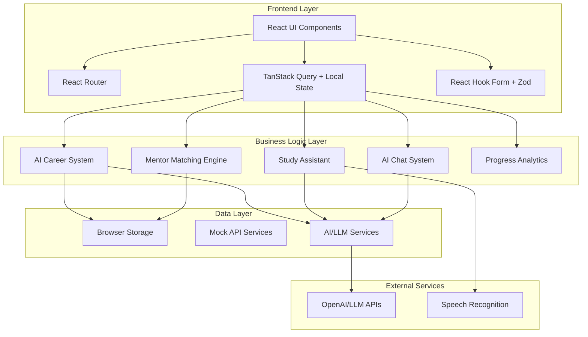

# Design Document: MentorX Platform

## Overview

MentorX is a comprehensive AI-powered learning and mentorship platform built with React 18.3.1, TypeScript, and modern web technologies. The platform addresses educational inequality by providing personalized career guidance, intelligent mentor matching, and adaptive study assistance through advanced GenAI/LLM integrations.

The system architecture follows a modular, component-based design with clear separation of concerns between UI components, business logic, and AI services. The platform emphasizes user experience through a clean light-mode interface, responsive design, and smooth interactions while maintaining high performance and accessibility standards.

## Architecture

### High-Level Architecture



### Technology Stack Architecture

- **Frontend Framework**: React 18.3.1 with TypeScript for type safety and modern React features
- **Build Tool**: Vite for fast development and optimized production builds
- **UI Components**: shadcn/ui components with custom light mode theming
- **Styling**: Tailwind CSS with custom configuration for responsive design
- **Routing**: React Router DOM v6 for client-side navigation
- **Forms**: React Hook Form with Zod validation for robust form handling
- **State Management**: TanStack Query for server state, React hooks for local state
- **Charts**: Recharts for analytics and progress visualization
- **AI Integration**: REST API calls to LLM services with streaming support

## Components and Interfaces

### Core Page Components

#### 1. Landing Page (`/`)
- **Purpose**: Marketing landing page with feature highlights and call-to-action
- **Key Features**: Hero section, feature showcase, testimonials, sign-up flow
- **Components**: Hero, FeatureGrid, TestimonialCarousel, CTASection

#### 2. Dashboard (`/dashboard`)
- **Purpose**: Main user hub displaying progress, achievements, and quick actions
- **Key Features**: Gamified progress tracking, XP/level system, streak counters, quick navigation
- **Components**: ProgressOverview, AchievementBadges, StreakTracker, QuickActions, RecentActivity

#### 3. Career Guidance (`/career-guidance`)
- **Purpose**: AI-powered career assessment and recommendation system
- **Key Features**: Interactive quiz, career path recommendations, personalized roadmaps
- **Components**: CareerQuiz, RecommendationEngine, RoadmapViewer, ProgressTracker

#### 4. Mentor Finder (`/mentor-finder`)
- **Purpose**: AI-powered mentor discovery and matching system
- **Key Features**: Keyword-based search, compatibility scoring, mentor profiles, connection requests
- **Components**: MentorSearch, MentorCard, CompatibilityScore, ConnectionManager

#### 5. Study Buddy (`/study-buddy`)
- **Purpose**: Adaptive AI study and interview preparation assistant
- **Key Features**: Multiple study modes, adaptive questioning, real-time feedback, voice integration
- **Components**: StudyModeSelector, QuestionEngine, FeedbackSystem, VoiceInterface, PerformanceAnalytics

#### 6. AI Chat (`/chat`)
- **Purpose**: Emotion-aware AI mentoring and coaching system
- **Key Features**: Contextual conversations, emotion detection, multiple coaching modes
- **Components**: ChatInterface, MessageBubble, EmotionDetector, CoachingModeSelector

#### 7. Community (`/community`)
- **Purpose**: Peer interaction and progress sharing platform
- **Key Features**: Progress posts, peer interactions, community challenges
- **Components**: CommunityFeed, ProgressPost, InteractionPanel, ChallengeBoard

#### 8. Opportunities (`/opportunities`)
- **Purpose**: AI-matched scholarships and internship discovery
- **Key Features**: Opportunity matching, application tracking, relevance scoring
- **Components**: OpportunityFeed, OpportunityCard, ApplicationTracker, RelevanceScore

### Shared UI Components

#### Navigation Components
- **Navbar**: Professional minimalist navigation with user profile and quick actions
- **Sidebar**: Collapsible navigation for dashboard and main sections
- **Breadcrumbs**: Contextual navigation for deep page hierarchies

#### Data Display Components
- **ProgressBar**: Animated progress indicators with percentage and visual feedback
- **StatCard**: Metric display cards with icons, values, and trend indicators
- **ChartContainer**: Wrapper for Recharts components with consistent styling
- **BadgeSystem**: Achievement and status badges with different variants

#### Interactive Components
- **QuizQuestion**: Reusable question component with multiple input types
- **SearchBar**: Enhanced search with filters, suggestions, and real-time results
- **ChatBubble**: Message display component with sender identification and timestamps
- **ActionButton**: Primary action buttons with loading states and feedback

#### Form Components
- **FormField**: Standardized form field wrapper with validation display
- **MultiStepForm**: Wizard-style form component for complex workflows
- **FileUpload**: Drag-and-drop file upload with progress indication
- **RatingInput**: Star rating and scale input components

### Interface Definitions

```typescript
// Core User Types
interface User {
  id: string;
  email: string;
  name: string;
  profile: UserProfile;
  progress: UserProgress;
  preferences: UserPreferences;
}

interface UserProfile {
  avatar?: string;
  bio?: string;
  skills: string[];
  interests: string[];
  careerGoals: string[];
  educationLevel: EducationLevel;
  experience: ExperienceLevel;
}

interface UserProgress {
  level: number;
  xp: number;
  streak: number;
  completedMilestones: string[];
  achievements: Achievement[];
  lastActivity: Date;
}

// Career Guidance Types
interface CareerAssessment {
  id: string;
  userId: string;
  responses: QuizResponse[];
  results: CareerRecommendation[];
  completedAt: Date;
}

interface CareerRecommendation {
  careerPath: string;
  compatibilityScore: number;
  reasoning: string;
  roadmap: LearningRoadmap;
  marketDemand: MarketData;
  salaryRange: SalaryRange;
}

interface LearningRoadmap {
  milestones: Milestone[];
  estimatedDuration: number;
  difficulty: DifficultyLevel;
  prerequisites: string[];
}

// Mentor Matching Types
interface Mentor {
  id: string;
  name: string;
  avatar: string;
  expertise: string[];
  bio: string;
  availability: AvailabilityStatus;
  rating: number;
  reviewCount: number;
  responseTime: string;
}

interface MentorMatch {
  mentor: Mentor;
  compatibilityScore: number;
  matchingFactors: string[];
  reasoning: string;
}

// Study System Types
interface StudySession {
  id: string;
  userId: string;
  mode: StudyMode;
  topic: string;
  questions: StudyQuestion[];
  performance: SessionPerformance;
  startTime: Date;
  endTime?: Date;
}

interface StudyQuestion {
  id: string;
  question: string;
  type: QuestionType;
  options?: string[];
  correctAnswer: string;
  explanation: string;
  difficulty: DifficultyLevel;
}

// Chat System Types
interface ChatMessage {
  id: string;
  content: string;
  sender: 'user' | 'ai';
  timestamp: Date;
  emotionalContext?: EmotionalContext;
  coachingMode?: CoachingMode;
}

interface EmotionalContext {
  sentiment: 'positive' | 'neutral' | 'negative';
  emotions: string[];
  confidence: number;
}

// Opportunity Types
interface Opportunity {
  id: string;
  title: string;
  type: 'scholarship' | 'internship' | 'job';
  organization: string;
  description: string;
  requirements: string[];
  deadline: Date;
  relevanceScore: number;
  applicationStatus?: ApplicationStatus;
}
```

## Data Models

### User Data Model

The user data model serves as the central entity connecting all platform features. It maintains comprehensive profile information, progress tracking, and personalization data.

```typescript
interface UserDataModel {
  // Identity and Authentication
  identity: {
    id: string;
    email: string;
    name: string;
    createdAt: Date;
    lastLoginAt: Date;
  };
  
  // Profile Information
  profile: {
    avatar?: string;
    bio?: string;
    location?: string;
    timezone: string;
    skills: SkillEntry[];
    interests: InterestEntry[];
    careerGoals: string[];
    educationLevel: EducationLevel;
    experienceLevel: ExperienceLevel;
  };
  
  // Progress and Gamification
  progress: {
    level: number;
    totalXP: number;
    currentStreak: number;
    longestStreak: number;
    completedMilestones: string[];
    achievements: Achievement[];
    weeklyGoals: WeeklyGoal[];
  };
  
  // Preferences and Settings
  preferences: {
    theme: 'light' | 'dark';
    notifications: NotificationSettings;
    privacy: PrivacySettings;
    learningStyle: LearningStyle;
    coachingPreferences: CoachingPreferences;
  };
}
```

### Career Assessment Data Model

Stores comprehensive career assessment data including quiz responses, AI-generated recommendations, and personalized learning paths.

```typescript
interface CareerAssessmentModel {
  assessmentId: string;
  userId: string;
  version: string;
  
  // Quiz Data
  responses: {
    questionId: string;
    answer: string | string[];
    confidence: number;
    timeSpent: number;
  }[];
  
  // AI Analysis Results
  analysis: {
    personalityProfile: PersonalityTraits;
    skillAssessment: SkillAnalysis;
    interestMapping: InterestAnalysis;
    careerAlignment: CareerAlignment[];
  };
  
  // Recommendations
  recommendations: {
    careerPath: string;
    compatibilityScore: number;
    reasoning: string;
    pros: string[];
    cons: string[];
    roadmap: DetailedRoadmap;
    marketInsights: MarketData;
  }[];
  
  // Metadata
  metadata: {
    completedAt: Date;
    processingTime: number;
    aiModelVersion: string;
    confidenceScore: number;
  };
}
```

### Mentor Matching Data Model

Manages mentor profiles, matching algorithms, and connection tracking between users and mentors.

```typescript
interface MentorDataModel {
  // Mentor Profile
  mentorId: string;
  profile: {
    name: string;
    avatar: string;
    title: string;
    company: string;
    bio: string;
    expertise: ExpertiseArea[];
    certifications: Certification[];
    languages: string[];
  };
  
  // Availability and Engagement
  availability: {
    status: AvailabilityStatus;
    schedule: TimeSlot[];
    responseTime: number; // in hours
    maxMentees: number;
    currentMentees: number;
  };
  
  // Performance Metrics
  metrics: {
    rating: number;
    reviewCount: number;
    successRate: number;
    totalSessions: number;
    averageSessionDuration: number;
  };
  
  // Matching Criteria
  matchingCriteria: {
    preferredMenteeLevel: ExperienceLevel[];
    focusAreas: string[];
    communicationStyle: CommunicationStyle;
    mentorshipApproach: MentorshipApproach;
  };
}

interface MentorMatchModel {
  matchId: string;
  userId: string;
  mentorId: string;
  
  // Matching Analysis
  compatibility: {
    overallScore: number;
    factorScores: {
      skillAlignment: number;
      personalityMatch: number;
      goalAlignment: number;
      communicationStyle: number;
    };
    reasoning: string;
    matchingFactors: string[];
  };
  
  // Connection Status
  connection: {
    status: ConnectionStatus;
    requestedAt: Date;
    respondedAt?: Date;
    connectedAt?: Date;
    lastInteraction?: Date;
  };
}
```

### Study Session Data Model

Tracks adaptive learning sessions, performance analytics, and personalized study recommendations.

```typescript
interface StudySessionModel {
  sessionId: string;
  userId: string;
  
  // Session Configuration
  configuration: {
    mode: StudyMode;
    topic: string;
    difficulty: DifficultyLevel;
    duration: number; // in minutes
    questionCount: number;
  };
  
  // Session Content
  content: {
    questions: StudyQuestionModel[];
    currentQuestionIndex: number;
    adaptiveAdjustments: AdaptiveAdjustment[];
  };
  
  // Performance Tracking
  performance: {
    correctAnswers: number;
    totalAnswers: number;
    averageResponseTime: number;
    difficultyProgression: DifficultyProgression;
    knowledgeGaps: string[];
    strengths: string[];
  };
  
  // AI Feedback
  feedback: {
    overallAssessment: string;
    improvementAreas: string[];
    nextSteps: string[];
    recommendedResources: Resource[];
    confidenceLevel: number;
  };
  
  // Session Metadata
  metadata: {
    startTime: Date;
    endTime?: Date;
    pausedDuration: number;
    deviceType: string;
    completionStatus: CompletionStatus;
  };
}
```

### Chat Conversation Data Model

Manages AI chat conversations with emotion detection, context preservation, and coaching mode adaptation.

```typescript
interface ChatConversationModel {
  conversationId: string;
  userId: string;
  
  // Conversation Metadata
  metadata: {
    startedAt: Date;
    lastMessageAt: Date;
    messageCount: number;
    averageResponseTime: number;
    primaryTopic: string;
    coachingMode: CoachingMode;
  };
  
  // Messages
  messages: {
    messageId: string;
    content: string;
    sender: 'user' | 'ai';
    timestamp: Date;
    
    // AI Analysis (for user messages)
    analysis?: {
      sentiment: SentimentAnalysis;
      emotions: EmotionDetection;
      intent: IntentClassification;
      urgency: UrgencyLevel;
    };
    
    // AI Response Context (for AI messages)
    responseContext?: {
      coachingStrategy: string;
      personalizedElements: string[];
      followUpSuggestions: string[];
      resourceRecommendations: Resource[];
    };
  }[];
  
  // Conversation Context
  context: {
    userGoals: string[];
    currentChallenges: string[];
    progressSummary: string;
    personalityInsights: PersonalityInsights;
    preferredCommunicationStyle: CommunicationStyle;
  };
}
```

## Correctness Properties

*A property is a characteristic or behavior that should hold true across all valid executions of a system—essentially, a formal statement about what the system should do. Properties serve as the bridge between human-readable specifications and machine-verifiable correctness guarantees.*

Before defining the correctness properties, I need to analyze the acceptance criteria from the requirements to determine which ones are testable as properties.

### Career Guidance System Properties

**Property 1: Quiz Generation Completeness**
*For any* user starting a career assessment, the Quiz_Engine should generate between 10-15 questions that cover all required categories: interests, skills, personality, learning preferences, and career goals.
**Validates: Requirements 1.1**

**Property 2: Career Recommendation Generation**
*For any* completed career quiz with valid responses, the AI_Career_System should generate at least one personalized career path recommendation with a detailed roadmap.
**Validates: Requirements 1.2**

**Property 3: Recommendation Metadata Completeness**
*For any* generated career recommendation, the Platform should include both a compatibility score (0-100) and reasoning text explaining the recommendation.
**Validates: Requirements 1.3**

**Property 4: Roadmap Creation from Career Selection**
*For any* selected career path, the AI_Career_System should create a personalized learning roadmap containing milestones and progress tracking capabilities.
**Validates: Requirements 1.4**

**Property 5: Adaptive Recommendation Updates**
*For any* user with progress data updates, the AI_Career_System should modify roadmap recommendations to reflect the new performance and engagement information.
**Validates: Requirements 1.5**

### Mentor Matching System Properties

**Property 6: Keyword-Based Mentor Filtering**
*For any* mentor search with keywords, the Mentor_Matcher should return only mentors whose expertise areas contain at least one of the search keywords.
**Validates: Requirements 2.1**

**Property 7: Compatibility Score Calculation**
*For any* filtered mentor results, the Mentor_Matcher should calculate and assign a valid compatibility score (0-100) to each mentor.
**Validates: Requirements 2.2**

**Property 8: Mentor Profile Display Completeness**
*For any* displayed mentor in search results, the Platform should show expertise areas, availability status, and compatibility rating.
**Validates: Requirements 2.3**

**Property 9: Connection Request Processing**
*For any* mentor connection request, the Platform should create a trackable connection request record with appropriate status tracking.
**Validates: Requirements 2.4**

**Property 10: Match Reasoning Provision**
*For any* mentor match with a compatibility score, the Mentor_Matcher should provide reasoning text explaining the compatibility factors.
**Validates: Requirements 2.5**

### Study System Properties

**Property 11: Study Mode Availability**
*For any* user starting a study session, the Study_Buddy should offer all three modes: study sessions, interview prep, and mock interviews.
**Validates: Requirements 3.1**

**Property 12: Adaptive Question Adjustment**
*For any* ongoing practice session, the Study_Buddy should adjust question difficulty and topics based on the user's performance patterns and identified knowledge gaps.
**Validates: Requirements 3.2**

**Property 13: Real-time Feedback Generation**
*For any* completed practice question, the Study_Buddy should provide immediate feedback and at least one improvement suggestion.
**Validates: Requirements 3.3**

**Property 14: Performance Analytics Generation**
*For any* study session with performance data, the Study_Buddy should generate analytics summary and personalized study plan recommendations.
**Validates: Requirements 3.4**

**Property 15: Voice Input Integration**
*For any* voice input when voice capabilities are available, the Study_Buddy should convert speech to text and process it as standard input.
**Validates: Requirements 3.5**

### Gamification System Properties

**Property 16: Dashboard Gamification Display**
*For any* user accessing their dashboard, the Platform should display XP points, current level, and streak counter with accurate calculations.
**Validates: Requirements 4.1**

**Property 17: Activity Reward System**
*For any* completed learning activity, the Platform should award appropriate XP points and update achievement levels accordingly.
**Validates: Requirements 4.2**

**Property 18: Progress Visualization**
*For any* user dashboard display, the Platform should show visual indicators for completed milestones and upcoming goals.
**Validates: Requirements 4.3**

**Property 19: Achievement Celebration**
*For any* newly unlocked achievement, the Platform should provide celebratory feedback and motivational messaging.
**Validates: Requirements 4.4**

**Property 20: Streak Tracking Accuracy**
*For any* daily engagement activity, the Platform should accurately maintain daily counters and preserve streak counts according to engagement rules.
**Validates: Requirements 4.5**

### AI Chat System Properties

**Property 21: Emotional Context Analysis**
*For any* user message in the chat system, the Chat_System should analyze and identify emotional context indicators from the message content.
**Validates: Requirements 5.1**

**Property 22: Adaptive Coaching Response**
*For any* detected emotional state, the Chat_System should adapt its coaching mode and response style to match the identified emotional context.
**Validates: Requirements 5.2**

**Property 23: Coaching Mode Availability**
*For any* chat interaction, the Chat_System should offer multiple coaching modes tailored to different user needs and situations.
**Validates: Requirements 5.3**

**Property 24: Conversation Context Maintenance**
*For any* ongoing conversation, the Chat_System should maintain context across multiple message exchanges and provide consistent interactions.
**Validates: Requirements 5.4**

**Property 25: Crisis Response Activation**
*For any* user message expressing distress or confusion, the Chat_System should provide appropriate resources and escalation options.
**Validates: Requirements 5.5**

### Community System Properties

**Property 26: Community Interaction Completeness**
*For any* user sharing progress to the community, the Platform should enable posting achievements and milestones, and support peer interactions through comments, reactions, and encouragement features.
**Validates: Requirements 6.1, 6.2**

**Property 27: Content Relevance Filtering**
*For any* user browsing community content, the Platform should display posts that are relevant to their interests and learning paths.
**Validates: Requirements 6.3**

**Property 28: Engagement Tracking and Rewards**
*For any* positive community interaction, the Platform should track the engagement and provide appropriate rewards or recognition.
**Validates: Requirements 6.5**

### Opportunity Matching Properties

**Property 29: Profile-Based Opportunity Analysis**
*For any* user with a complete profile, the Platform should analyze their background and goals to identify relevant opportunities.
**Validates: Requirements 7.1**

**Property 30: Opportunity Compatibility Scoring**
*For any* available opportunity, the Platform should calculate AI-powered compatibility scores based on user profile matching.
**Validates: Requirements 7.2**

**Property 31: Opportunity Display Completeness**
*For any* displayed opportunity, the Platform should show relevance scores and complete application requirements.
**Validates: Requirements 7.3**

**Property 32: Application Status Tracking**
*For any* opportunity application, the Platform should track application status and provide guidance throughout the process.
**Validates: Requirements 7.4**

**Property 33: Opportunity Notification Targeting**
*For any* new opportunity becoming available, the Platform should notify only users whose profiles and preferences match the opportunity criteria.
**Validates: Requirements 7.5**

## Error Handling

### Input Validation and Sanitization

The platform implements comprehensive input validation at multiple layers:

- **Client-side validation**: React Hook Form with Zod schemas for immediate user feedback
- **Type safety**: TypeScript interfaces ensure compile-time type checking
- **Sanitization**: All user inputs are sanitized before processing or storage
- **Rate limiting**: API calls are rate-limited to prevent abuse

### AI Service Error Handling

AI service integrations include robust error handling:

- **Fallback responses**: When AI services are unavailable, provide cached or default responses
- **Timeout handling**: Implement reasonable timeouts for AI API calls with user feedback
- **Graceful degradation**: Core functionality remains available even when AI features fail
- **Error logging**: Comprehensive logging for AI service failures and performance monitoring

### Data Consistency and Recovery

- **Local storage backup**: Critical user data is backed up to browser local storage
- **State synchronization**: Ensure UI state remains consistent with data layer
- **Optimistic updates**: Provide immediate UI feedback with rollback capabilities
- **Data validation**: Validate data integrity before processing or display

### User Experience Error Handling

- **Friendly error messages**: Convert technical errors into user-friendly language
- **Recovery suggestions**: Provide actionable steps for users to resolve issues
- **Progress preservation**: Maintain user progress during error recovery
- **Accessibility**: Ensure error messages are accessible to screen readers

## Testing Strategy

### Dual Testing Approach

The MentorX platform employs a comprehensive testing strategy combining unit tests and property-based tests to ensure both specific functionality and universal correctness properties.

**Unit Testing Focus:**
- Specific examples demonstrating correct behavior
- Edge cases and boundary conditions
- Error handling and validation scenarios
- Integration points between components
- UI component rendering and interaction

**Property-Based Testing Focus:**
- Universal properties that hold for all valid inputs
- Comprehensive input coverage through randomization
- AI system behavior validation across diverse scenarios
- Data consistency and integrity properties
- System behavior under various user interaction patterns

### Property-Based Testing Configuration

**Testing Framework**: Fast-check for JavaScript/TypeScript property-based testing
**Test Configuration**: Minimum 100 iterations per property test to ensure comprehensive coverage
**Test Tagging**: Each property test references its corresponding design document property

Example property test structure:
```typescript
// Feature: mentorx-platform, Property 1: Quiz Generation Completeness
test('career quiz generates complete question set', () => {
  fc.assert(fc.property(
    fc.record({
      userId: fc.string(),
      userProfile: userProfileArbitrary
    }),
    (input) => {
      const quiz = generateCareerQuiz(input);
      expect(quiz.questions.length).toBeGreaterThanOrEqual(10);
      expect(quiz.questions.length).toBeLessThanOrEqual(15);
      expect(hasAllRequiredCategories(quiz.questions)).toBe(true);
    }
  ), { numRuns: 100 });
});
```

### Testing Coverage Areas

**AI System Testing:**
- Career recommendation accuracy and consistency
- Mentor matching algorithm reliability
- Study buddy adaptive behavior
- Chat system emotional context detection
- Opportunity matching relevance

**User Interface Testing:**
- Component rendering across different screen sizes
- Form validation and submission flows
- Navigation and routing behavior
- Accessibility compliance
- Performance under various data loads

**Data Management Testing:**
- Local storage persistence and retrieval
- State management consistency
- Data validation and sanitization
- Cache invalidation and updates
- Cross-component data flow

**Integration Testing:**
- AI service integration reliability
- Voice-to-text functionality
- Real-time chat features
- Progress tracking accuracy
- Notification system delivery

### Performance and Load Testing

- **Response time validation**: Ensure sub-200ms response times for standard operations
- **Memory usage monitoring**: Track memory consumption during extended usage
- **Concurrent user simulation**: Test system behavior under multiple simultaneous users
- **Large dataset handling**: Validate performance with extensive user data and content

The testing strategy ensures that the MentorX platform maintains high quality, reliability, and user experience standards while providing comprehensive coverage of both specific use cases and general system properties.